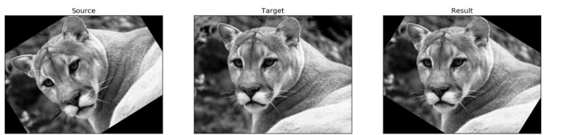

# Image Registration using Gaussian Pyramids

**Objective**

Given an image and its rotated copy of the same size, estimate the rotation angle using Gaussian Pyramids

**Technical Details**

Code developed using Python 2.7

Dependencies: matplotlib, opencv, numpy
